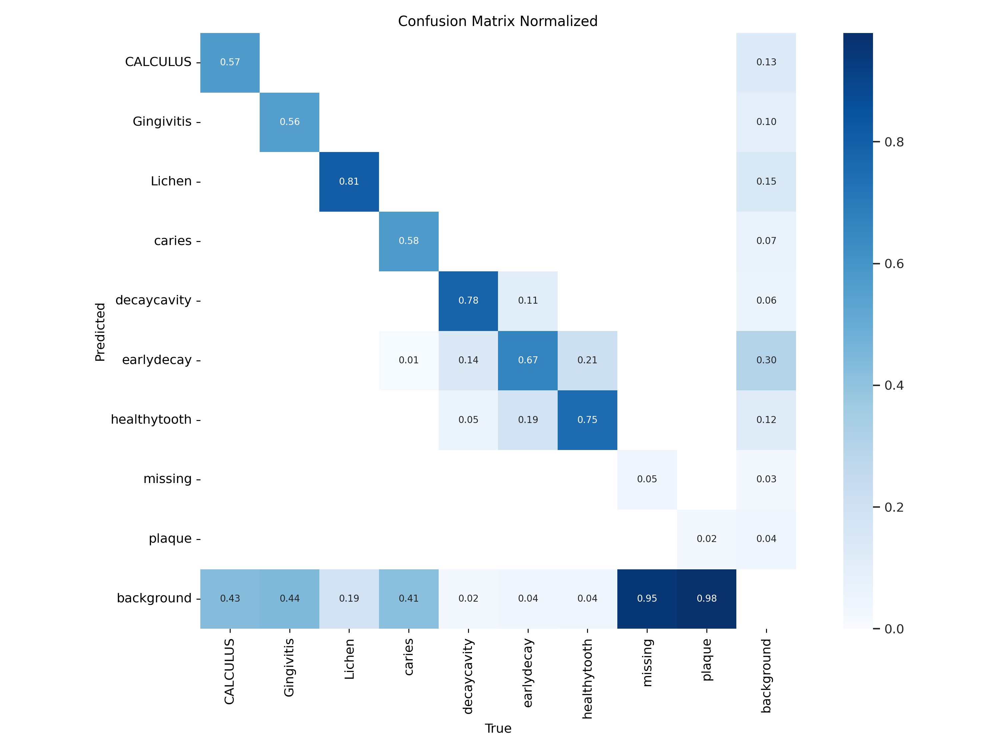
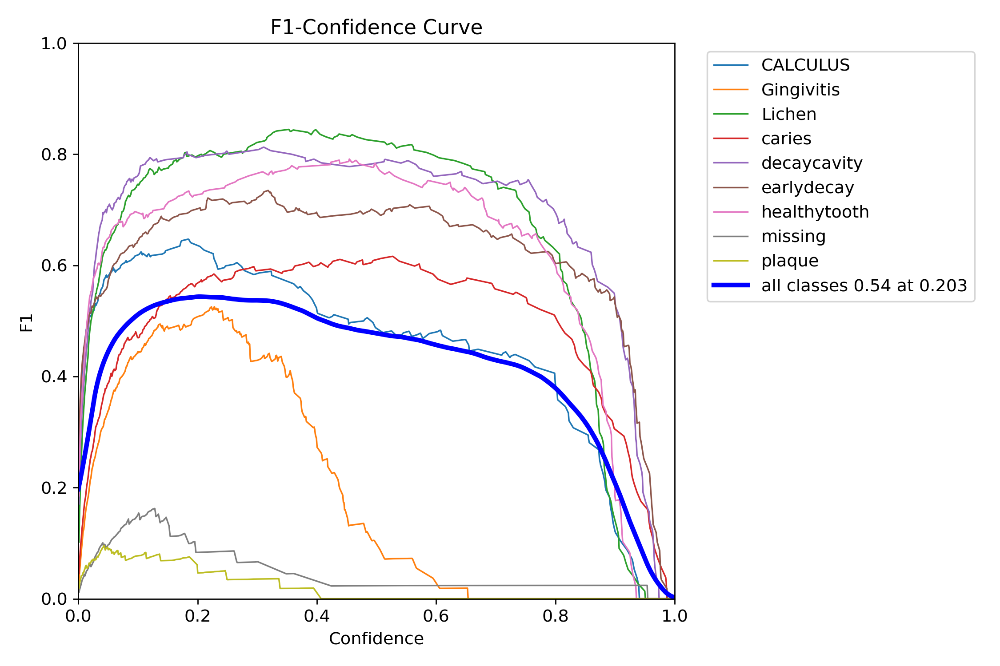
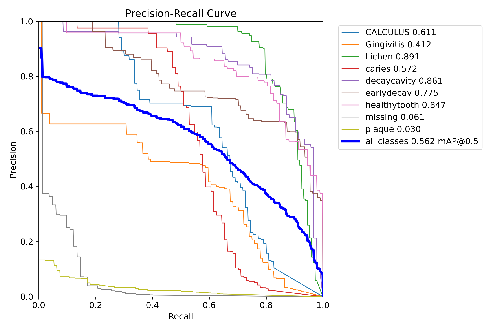
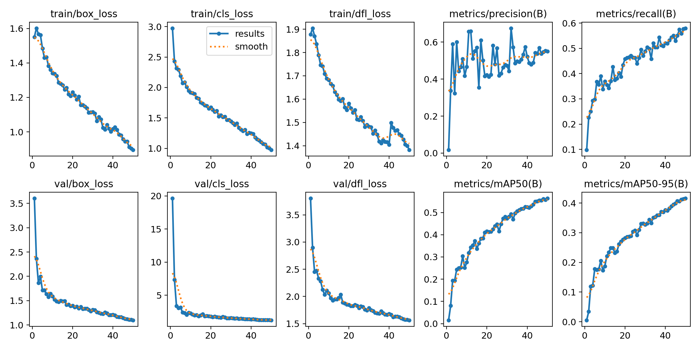

# SmileAI: AI-Based Diagnosis for Oral Conditions

SmileAI is a cutting-edge project aimed at assisting early diagnosis and treatment planning in the field of oral healthcare through automated and accurate image segmentation. This project leverages the YOLOv11 large model to detect and classify various oral conditions.

---

## Table of Contents
1. [About the Project](#about-the-project)
2. [Technologies Used](#technologies-used)
3. [Dataset Details](#dataset-details)
4. [Getting Started](#getting-started)
5. [Model Performance](#model-performance)
6. [Future Work](#future-work)
7. [Contact](#contact)

---

## About the Project

SmileAI focuses on improving oral healthcare diagnosis using advanced object detection techniques. It uses the YOLOv11 large model trained on a dataset containing 2899 images annotated with various oral conditions, such as CALCULUS, Gingivitis, Lichen, Caries, DecayCavity, EarlyDecay, HealthyTooth, Missing, and Plaque.

This project can assist healthcare professionals by enabling early detection and better treatment planning.

---

## Technologies Used

- **YOLO Version**: YOLOv11
- **Programming Language**: Python 3.9
- **Libraries**: Numpy, Pandas, Roboflow, Ultralytics
- **Environment**: Jupyter Notebook

---

## Dataset Details

The dataset used in this project is sourced from [RoboFlow Universe](https://universe.roboflow.com/detection12/dent_final2).  
It consists of 2899 labeled images representing the following classes:
- CALCULUS
- Gingivitis
- Lichen
- Caries
- DecayCavity
- EarlyDecay
- HealthyTooth
- Missing
- Plaque

---

## Getting Started

### Prerequisites
Make sure you have the following installed:
- Python 3.9
- Required libraries listed in `requirements.txt`

### Installation
1. Clone the repository:
   ```bash
   git clone https://github.com/your-username/SmileAI.git
   cd SmileAI
2. Install the libraries
   ```bash
   pip install -r requirements.txt

## Model Performance
### 1. Normalized Confusion Matrix


- Strong performance for **Lichen** (0.81) and **DecayCavity** (0.78).
- Misclassifications observed in **Plaque** and **EarlyDecay**, with spillover into "Background."
- Moderate accuracy for **HealthyTooth** (0.75), with some confusion with **DecayCavity**.

---

### 2. F1-Confidence Curve


- Best F1 score: **0.54** at confidence **0.203**.
- High F1 for **Lichen** and **DecayCavity**.
- Poor F1 for **Plaque** and **Missing**, indicating issues with these classes.

---

### 3. Precision-Recall Curve


- High precision and recall for **Lichen** and **DecayCavity**.
- Low recall for **Gingivitis** and **Plaque**, indicating frequent missed detections.
- Overall mAP@0.5: **0.562**.

---

### 4. Training Metrics


- Loss metrics (box, classification, DFL) consistently decrease, indicating proper convergence.
- Validation loss slightly higher than training loss, suggesting mild overfitting.

---
